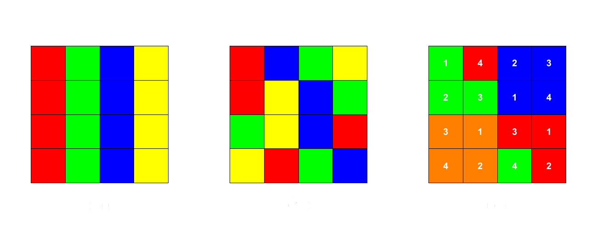

# Hypercube sorting 

The aim of this repository is to present the algorythm to
decompose permutation on cubic lattices using only nearest 
neighbour swaps in *almost* optimal way.

Permutation of hypercube nodes is represented by class Permutation, 
with the dimensions of hypercube encoded as tuple `cube_dimensions` 
and the permutation of nodes as one dimensional numpy Array `perm`.

The main method of the class is `hypercube_sort`, which calls 
recursive static method `__hypercube_sort` that creates 
decomposition of permutation using only nearest neighbour swaps.

## Explanation

The action of the algorythm can be to explain by 
two-dimensional example.

- When the elements are permuted only
column-wise, each column may be decomposed separately using
[Odd-even sort](https://en.wikipedia.org/wiki/Odd%E2%80%93even_sort)
algorythm.
- In more general case, the columns are mixed, however, each row
contains elements from all columns. So one can reduce the problem
by first placing each element its column by independently 
sorting the rows.
- Generic scenario can be reduced to the previous one by 
appropriated permutation in columns. The method 
`__enumerate_permutation_elements` enumerate the nodes 
in such a way that nodes originated form each colum and nodes 
located in each column do not have repeated marks.
Then independent sort in columns can be applied to obtain 
desired reduction.

|                                                                                                  <To update>                                                                                                  |
|:-----------------------------------------------------------------------------------------------------------------------------------------------------------------------------------------------------------------------------------------------------:|
| (a) Nodes on a square lattice with correct columns, the original column for each element is denoted by its colour.  (b) The columns are mixed, but there is only one colour in each row.  (c) The most complex case with appropriate marking. |

For 3D and higher dimensions the lattice is flattened 
into two-dimensional one, and flattened dimensions are sorted 
reversely.

## Further reading

Extended discussion of algorythm, complexity of
obtained results and the proof of correctness is presented in the paper 
[Fidelity decay and error accumulation in quantum volume circuits](https://arxiv.org/)
<to update the link>.

The algorythm was inspired by the work 
[Routing Permutations on Graphs via Matchings](https://dl.acm.org/doi/10.1145/167088.167239).
